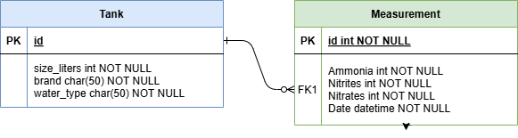

### Shrimp Tank Database

Welcome to my final project (version v1.0.0)

I created this basic Django web application to help me manage my aquarium, which currently contains mainly *neocaridina davidi* (red cherry shrimp).
Most aquarium owners regularly test water parameters with a test kit that measure levels of ammonia, nitrates, nitrites, etc. in the water.  I usually write down those measurements on a piece of paper,
but this webapp should make things easier going forward. 

Although I currently own one aquarium (a Fluval Spec 5 gallon tank), this webapp design allows multiple tanks to be entered. Tanks have to be added in Admin view, but measurements can be added from any user's view via a form submission.
This makes sense to me logically, because only I can decide how many aquariums I own, but potentially multiple people (siblings, roommates) may be allowed to test the water parameters. 

Notably, the HTML interface aspects of this project are very bare-bones. In the future I might add .css files for better formatting or prettier views. Other aspects of this project that I might improve on later include
adding more parameters to the *Measurement* model (pH, KH, TDS), which I did not include in this current version of the project for simplicity (and because in reality I am most concerned about levels of ammonia, nitrites, and nitrates). 

Regarding the assignment specifications, here is how this project met the requirements:

1. Data submission view: accessible at the /add url, this view allows a user to add measurements to a given tank object.
2. Useful visual: accesible at the /parameters url, this view shows all collected measurements of ammonia, nitrites, and nitrates in the form of a bar chart, which allows the user to view changes over time.
3. Admin interface: accessible at the /admin url, this view allows the user to add tank objects and otherwise add model instances
4. Tests: I used pytest-django to verify that that the relationship between models functioned properly and that views were working. Tests can be ran using the "pytest" command.

Note: After running the package, this webapp should be accessibe on http://127.0.0.1:8000/. For (temporary!) testing purposes, the login/password for the admin view is weronika/password. 

   
Below is an ERD of the model relationships (Tank and Measurement). 

Special thanks to all the miscellanous old blog posts and YouTube videos that helped make this project possible:

https://www.sitepoint.com/community/t/getting-random-image-to-work/307845/4

https://www.horilla.com/blogs/how-to-export-django-model-data-to-an-excel-sheet-using-pandas/

https://www.youtube.com/watch?v=BaMo4IG3y8w&t=193s

https://www.geeksforgeeks.org/software-testing/how-do-i-run-the-pytest-tests-in-django/

https://www.docker.com/blog/how-to-dockerize-django-app/

and, of course, the official Django/ChartJS/Docker documentation. 

